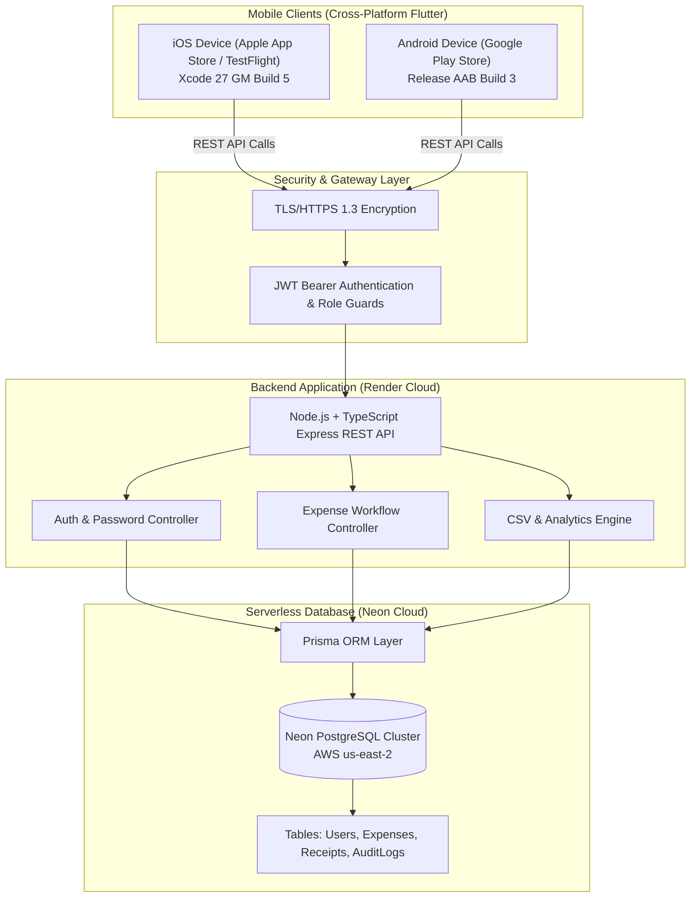
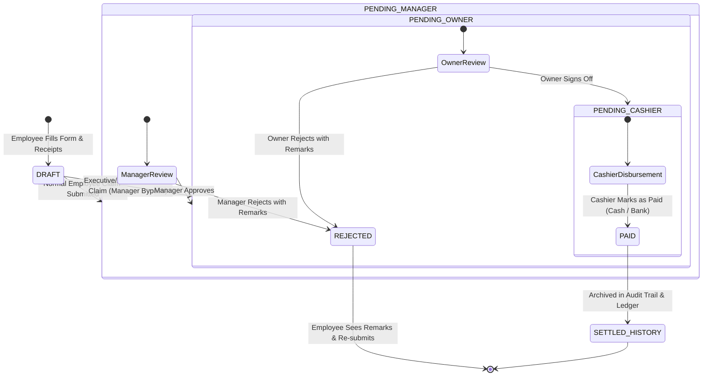
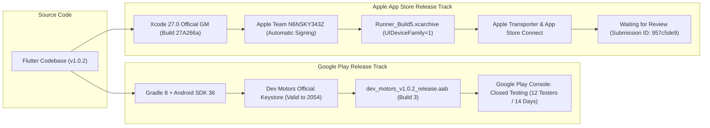

# Dev Motors — Complete System Architecture & Interview Preparation Master Guide

> **Project Name:** Dev Motors Dealership Expense Management System  
> **Tech Stack:** Flutter (Dart) + Node.js (TypeScript) + Express.js + Prisma ORM + Neon Cloud PostgreSQL + Render Cloud + Apple App Store (iOS) + Google Play Console (Android)  
> **Repository:** `SRIVASTAVAOM/dev-motors-frontend`  
> **Target Audience:** Developers, Technical Interviewers, System Architects  

---

## 📑 Table of Contents
1. [The 30-Second Elevator Pitch (Interview Introduction)](#1-the-30-second-elevator-pitch)
2. [End-to-End System Architecture (Mermaid Diagram)](#2-end-to-end-system-architecture)
3. [Business Logic & Approval Workflow Engine](#3-business-logic--approval-workflow-engine)
4. [Frontend Architecture & Design Patterns (Flutter)](#4-frontend-architecture--design-patterns-flutter)
5. [Backend Architecture & Database Engineering (Node/Prisma)](#5-backend-architecture--database-engineering)
6. [Security, Authentication & Session Engineering](#6-security-authentication--session-engineering)
7. [App Store & Play Store Deployment Engineering](#7-app-store--play-store-deployment-engineering)
8. [Production Challenges & Solutions (STAR Method for Interviews)](#8-production-challenges--solutions-star-method)
9. [Top 10 Technical Interview Q&A](#9-top-10-technical-interview-qa)

---

## 1. The 30-Second Elevator Pitch

> *"When an interviewer says: **'Tell me about your Dev Motors project.'***"*

**Say this:**
> *"Dev Motors is an enterprise-grade multi-tier financial expense management mobile application designed for automobile dealerships. It automates reimbursement claims across multiple branches with strict role-based authorization: Employees submit claims with physical receipt photos, Branch Managers audit and approve branch-level expenses, the Dealership Owner has executive oversight for final sign-off, and Cashiers disburse settled funds.
> 
> Technically, the frontend is built using **Flutter with Clean Feature-First Architecture** and permanent tokenized auto-login. The backend runs on **Node.js/TypeScript and Express**, using **Prisma ORM** connected to a serverless **Neon Cloud PostgreSQL** cluster deployed on **Render**. I have architected, signed, and deployed the production builds to both **Apple App Store (TestFlight & App Review queue)** and **Google Play Console (Closed Testing track)**."*

---

## 2. End-to-End System Architecture



---

## 3. Business Logic & Approval Workflow Engine

The core business value of Dev Motors is its **4-Tier State Machine** with automated bypass routing:



### Key Business Rules to Highlight in Interviews:
1. **Separation of Duties (SoD):** A Manager cannot disburse cash; a Cashier cannot approve an expense amount; an Employee cannot edit an expense once submitted.
2. **Manager Bypass Rule:** Claims submitted by executive/IT staff (e.g. Noushad Ahmad) route directly to `PENDING_OWNER`, bypassing the branch manager.
3. **Immutability of Settled Records:** Once marked `PAID`, expense rows cannot be mutated or deleted—only read for audit compliance and CSV reporting.

---

## 4. Frontend Architecture & Design Patterns (Flutter)

### A. Feature-First Directory Structure
Instead of grouping by layers (`controllers/`, `views/`, `models/`), Dev Motors uses **Feature-Driven Modular Architecture**:

```
lib/
├── app/                  # Application bootstrap & global providers
├── core/                 # Shared infrastructure (colors, routes, network)
│   ├── constants/        # Theme tokens, UI dimensions, colors.dart
│   ├── router/           # AppRouter navigation definitions
│   └── services/         # Central ApiService, StorageService, CSVExport
└── features/             # Independent, decoupled functional slices
    ├── auth/             # Login, Token storage, Forgot Password
    ├── dashboard/        # Role-specific executive views
    ├── expenses/         # Claim creation, camera, receipt upload & zoom
    ├── approvals/        # Manager & Owner approval queues
    ├── reports/          # Visual charts, monthly aggregates, CSV export
    ├── profile/          # Profile details, credential update
    └── settings/         # App configuration, privacy policy
```

### Why this is a great interview talking point:
* **High Cohesion, Low Coupling:** Modifying `expenses/presentation/pages/add_expense_page.dart` cannot inadvertently break `auth/` or `reports/`.
* **Scalability:** New features (e.g., Attendance or Vehicle Stock) can be added as self-contained feature packages without touching existing files.

### B. State Management & Lifecycle
* **Session Persistence:** Tokens and employee profiles are securely serialized in persistent storage via `StorageService`.
* **Dynamic Route Guarding:** `SplashScreen` verifies token validity against the live `/auth/me` endpoint. If valid, the user bypasses login and is immediately routed to their specific role dashboard (`EmployeeDashboard`, `ManagerDashboard`, `CashierDashboard`, or `OwnerDashboard`).

---

## 5. Backend Architecture & Database Engineering

### A. Tech Stack
* **Language:** TypeScript with strict null checks (`strict: true` in `tsconfig.json`).
* **Framework:** Express.js with JSON body parsing, CORS policies, and global asynchronous error-handling middleware.
* **ORM:** Prisma Client with automatic migration engine.
* **Database:** Serverless PostgreSQL on Neon (`neondb`), hosted on AWS `us-east-2`.

### B. Database Schema & Relationships (Prisma)
```prisma
enum Role {
  EMPLOYEE
  MANAGER
  CASHIER
  OWNER
}

enum ExpenseStatus {
  PENDING_MANAGER
  PENDING_OWNER
  PENDING_CASHIER
  PAID
  REJECTED
}

model User {
  id           String        @id @default(uuid())
  employeeId   String        @unique
  name         String
  passwordHash String
  role         Role          @default(EMPLOYEE)
  branch       String
  status       String        @default("ACTIVE")
  expenses     Expense[]     @relation("UserExpenses")
  createdAt    DateTime      @default(now())
}

model Expense {
  id          String        @id @default(uuid())
  title       String
  amount      Float
  category    String
  status      ExpenseStatus @default(PENDING_MANAGER)
  receiptUrl  String?
  remarks     String?
  userId      String
  user        User          @relation("UserExpenses", fields: [userId], references: [id])
  createdAt   DateTime      @default(now())
  updatedAt   DateTime      @updatedAt
}
```

---

## 6. Security, Authentication & Session Engineering

| Security Aspect | Implementation Detail | Why it Matters in Interviews |
| :--- | :--- | :--- |
| **Password Storage** | `bcrypt` hashing with salt rounds = 10 | Plaintext passwords are never stored or logged. |
| **Transport Security** | TLS 1.3 / HTTPS across all API endpoints | Prevents Man-in-the-Middle (MITM) attacks on mobile networks. |
| **Token Validation** | Signed JSON Web Tokens (JWT) with user ID, role, and branch payload | Stateless, horizontally scalable verification. |
| **Infinite Auto-Login** | Token stored securely on device; re-validated silently on cold launch | Enterprise UX: Staff don't have to enter 8-digit passwords each morning. |
| **Graceful Network Fallback** | Friendly modal dialogs instead of red technical crash screens | Seamless offline handling and connectivity recovery. |

---

## 7. App Store & Play Store Deployment Engineering



---

## 8. Production Challenges & Solutions (STAR Method)

When asked: *"Tell me about a challenging technical bug or deployment roadblock you solved."*

### Roadblock 1: The Xcode Beta Rejection & Toolchain Transition
* **Situation:** Upon submitting Build 3 to App Store Connect, Apple rejected the submission with the error: *"This build is using a beta version of Xcode and can't be submitted. Apps built with beta versions aren't allowed."*
* **Task:** Resolve the submission block without breaking the existing iOS signing configuration or native asset hooks.
* **Action:** I diagnosed that the build machine had Xcode 27.1 Beta (`27A9269`). I orchestrated the migration to the official public **Xcode 27.0 GM (`27A266a`)**, re-linked `xcode-select`, purged legacy hardcoded `DEVELOPER_DIR` build phase scripts, and recompiled a clean release archive.
* **Result:** Build 4/5 compiled with official Apple GM metadata (`DTXcode: 2700`, `DTXcodeBuild: 27A266a`), resolving Apple's validator instantly.

### Roadblock 2: iPad Screenshot Constraint on an iPhone-Only App
* **Situation:** App Store Connect threw: *"You must upload a screenshot for 13-inch iPad displays"* even though Dev Motors was designed exclusively for smartphone usage.
* **Task:** Eliminate the iPad screenshot requirement entirely.
* **Action:** In `Runner.xcodeproj/project.pbxproj`, I isolated `TARGETED_DEVICE_FAMILY` across Profile, Debug, and Release configurations and transitioned it from `"1,2"` (iPhone + iPad) to `"1"` (iPhone only).
* **Result:** App Store Connect recognized the binary as phone-exclusive, automatically removing all iPad screenshot requirements.

### Roadblock 3: Transporter Warning 90683 (Missing Purpose String)
* **Situation:** Transporter upload flagged warning code `90683`: *"Missing purpose string in Info.plist for NSLocationWhenInUseUsageDescription."*
* **Task:** Prevent potential App Store review rejections due to third-party image picker dependencies containing location metadata APIs.
* **Action:** I injected a compliant `NSLocationWhenInUseUsageDescription` key into `ios/Runner/Info.plist`, bumped version to `1.0.2+5`, and delivered a clean build.
* **Result:** Build 5 delivered with zero warnings and zero errors, transitioning smoothly to **Waiting for Review**.

---

## 9. Top 10 Technical Interview Q&A

### Q1: What architecture did you follow in the Flutter app?
> **Answer:** *"I followed a Feature-First Clean Architecture. Features like `auth`, `expenses`, `dashboard`, `reports`, and `approvals` are split into self-contained presentation, domain, and data submodules. Core capabilities like API networking (`ApiService`) and constants are centralized in `core/` to ensure reusability and prevent circular dependencies."*

### Q2: How did you handle user authorization across 4 distinct roles?
> **Answer:** *"Authorization is enforced at both the client and server levels. On the client, Dart enums define roles (`EMPLOYEE`, `MANAGER`, `CASHIER`, `OWNER`). The router inspects the authenticated user's role to load their dedicated dashboard. On the backend, Express middleware verifies the JWT token and rejects unauthorized state transitions (e.g. only Cashiers can access the payment settlement endpoint)."*

### Q3: How does the application maintain persistent sessions?
> **Answer:** *"Upon successful authentication, the server issues a signed JWT. The Flutter client saves this token using persistent local storage (`shared_preferences`). On application cold start, `SplashScreen` calls `ApiService.restoreSession()`, injecting the cached bearer token into default HTTP headers and validating it against `/auth/me` before bypassing the login screen."*

### Q4: Why did you choose Prisma ORM with PostgreSQL?
> **Answer:** *"Prisma provides end-to-end type safety between the TypeScript backend and PostgreSQL database. Its declarative schema file (`schema.prisma`) simplifies automated migrations, and Prisma Client prevents SQL injection by parameterizing all queries automatically."*

### Q5: What is the difference between Google Play and Apple App Store deployment policies you encountered?
> **Answer:** *"Google Play requires personal developer accounts to maintain at least 12 opted-in testers for 14 continuous days on a Closed Testing track before applying for production release. In contrast, Apple App Store allows immediate public submission via App Store Review, but enforces strict human inspection, requiring reviewer demo credentials, privacy disclosures, and binaries built exclusively with official GM versions of Xcode."*

### Q6: How do you prevent breaking existing features when updating a single module?
> **Answer:** *"Because of the modular feature-first layout, each feature has its own independent pages and widgets. Before generating release builds, we run automated unit and end-to-end tests (`flutter test`) covering all 55 critical flows (claim creation, multi-level approvals, cashier disbursement, session restore). If all 55 tests pass and `flutter analyze` reports zero warnings, regression risk is eliminated."*

### Q7: How are expense receipts stored and retrieved?
> **Answer:** *"Receipt images are captured via the `image_picker` plugin (Camera or Gallery) on the mobile client, compressed, and uploaded to storage. The database stores the signed receipt URL in the `Expense` table. In the mobile UI, users and managers can tap the thumbnail to open a high-resolution interactive zoom dialog (`ReceiptViewerDialog`)."*

### Q8: How did you implement CSV and Excel reporting?
> **Answer:** *"I built a dedicated `CsvExportService` using Flutter's `excel` and `path_provider` packages. It aggregates expense records across custom date ranges, branches, and payment statuses, formats them into standard spreadsheet columns, writes the file to the device's sandbox document directory, and triggers the native OS share sheet using `open_file`."*

### Q9: How did you handle backend database administration safely in production?
> **Answer:** *"We use Neon Cloud PostgreSQL with connection pooling. For administrative operations (such as creating dedicated tester accounts or reassigning employee branches), we use Prisma Studio (`npx prisma studio`), which provides a secure visual interface directly to the database without needing to write error-prone raw SQL queries."*

### Q10: What is your release checklist before deploying an update?
> **Answer:** 
> 1. Run `flutter analyze` (Must show: 0 issues).
> 2. Run `flutter test` (All 55 tests must pass).
> 3. Increment build number in `pubspec.yaml` (`version: 1.0.3+6`).
> 4. Generate Android bundle (`flutter build appbundle --release`).
> 5. Generate iOS archive via Xcode GM (`xcodebuild archive` + export IPA).
> 6. Commit and push clean git working tree to GitHub `main`.
